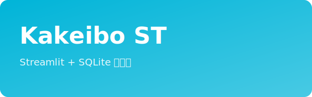
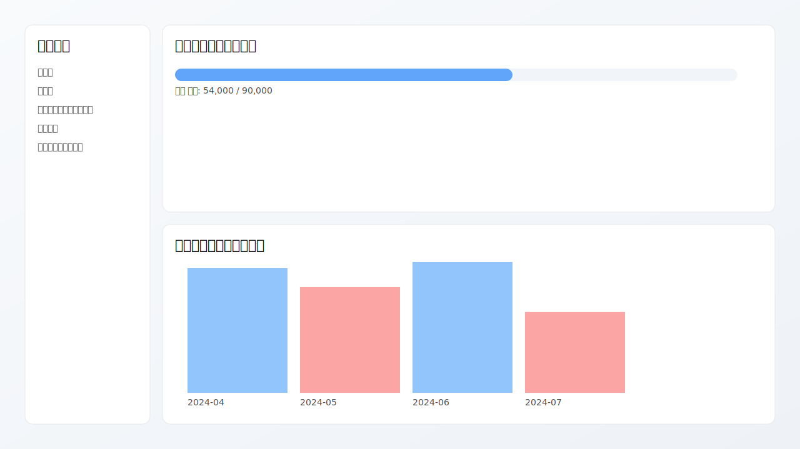
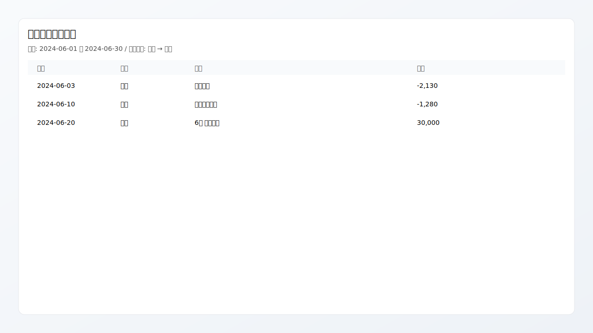

<div align="center">

  

  <p>
    シンプルでサクッと使える、Streamlit + SQLite 家計簿
  </p>

  <p>
    <a href="https://img.shields.io/badge/Python-3.12-blue"> </a>
    <a href="https://img.shields.io/badge/Streamlit-1.35-ff4b4b"> </a>
    <a href="https://img.shields.io/badge/DB-SQLite-003b57"> </a>
    <a href="https://img.shields.io/badge/Package-uv-4b8bbe"> </a>
    <a href="https://img.shields.io/badge/Container-Docker-2496ed"> </a>
  </p>

</div>

---

## 概要

Python/Streamlit 製のシンプルな家計簿アプリです。データは SQLite に保存され、Docker/Fly.io での運用を前提に永続ボリューム（`/data/kakeibo.db`）へ書き込みます。サイドバーから「追加」「編集」「カテゴリー追加・編集」「グラフ」「開発者オプション」を切り替えて利用します。

主な機能
- 追加: 日付・種別（支出/収入/予算）・詳細・小カテゴリを選んで登録
- 編集: 期間絞り込み＋表形式編集（追加/更新/削除）と合計表示
- カテゴリー追加・編集: 小カテゴリの追加/リネーム（大カテゴリは初期データ）
- グラフ: 月次の収入/支出と累計資産推移（2023-10以降）
- 予算進捗: 指定月の「日常」カテゴリの予算対比プログレス表示
- 贈与見える化: 「贈与」小カテゴリの収入と返礼（支出）を対比
- 開発者オプション: DB ダウンロード、任意 SQL 実行（バックアップ関連は現状オフ）

補足
- Google スプレッドシート連携/Gemini による分析コードはリポジトリ内にありますが、現状はコメントアウトされており未使用です。
- 初期データ（シード）は `data/kakeibo.db` に同梱。初回起動時に `/data/kakeibo.db` へコピーされます（Docker 実行時）。

## 構成 / 技術スタック

- 言語: Python 3.12
- フレームワーク: Streamlit
- データベース: SQLite（パス: `/data/kakeibo.db`）
- データアクセス: SQLAlchemy Core（パラメータ化クエリ）
- パッケージ管理: `uv`（推奨。Docker も `uv` 使用）
- デプロイ: Fly.io（`fly.toml` 同梱）

主なテーブル
- `main_categories(id, name)`
- `sub_categories(id, main_category_id, name)`
- `transactions(id, sub_category_id, amount, type['支出','収入','予算'], date, detail)`
- `backup_time(id, time)`

## セットアップ（ローカル）

前提: Python 3.12 以上。

依存関係のインストール（推奨順）
- `uv sync`（推奨）
- 参考: `pip install -r requirements.txt`（uv を使わない場合）

注意（重要）
- 既定のデータディレクトリは `/data` です。権限の都合で書き込めない環境では自動で `./runtime-data` にフォールバックします。
- 明示的に保存先を変えたい場合は環境変数 `KAKEIBO_DATA_DIR` を指定してください（例: `KAKEIBO_DATA_DIR=./runtime-data`）。

起動
- `uv run streamlit run app.py`
- ブラウザで `http://localhost:8501` を開く

初期データ
- 同梱の `data/kakeibo.db` を利用したい場合は、`/data/kakeibo.db` にコピーしてください（Docker 実行では自動）。

## スクリーンショット

<p align="center">
  
  <br/>
  <em>ダッシュボード（予算進捗 / 月次サマリのイメージ）</em>
  </p>

<p align="center">
  
  <br/>
  <em>編集画面（表形式の編集イメージ）</em>
</p>

## Docker で実行（推奨）

永続ボリュームをマウントして起動する例:

```
docker build -t kakeibo-st .
docker run --rm -p 8501:8501 -v $(pwd)/runtime-data:/data kakeibo-st
```

メモ
- 初回起動時、`data/kakeibo.db` があれば `/data/kakeibo.db` へコピー、無ければ空スキーマを生成します（`start.sh`）。
- データはホストの `./runtime-data/kakeibo.db` に永続化されます。

## Fly.io へデプロイ

前提: Fly CLI セットアップ済み、ボリュームを `/data` にマウントする設定は `fly.toml` に記載済み。

おおまかな流れ（例）
1. `fly launch`（既存アプリ名を使う場合はスキップ）
2. `fly volumes create data --size 1`（必要なら）
3. `fly deploy`

デプロイ後、アプリはポート `8501` で待ち受けます。

## GitHub Actions（CD）

main ブランチに push したら自動で Fly.io にデプロイするワークフローを同梱しています（`.github/workflows/fly-deploy.yml`）。

準備
- リポジトリ Secrets に `FLY_API_TOKEN` を登録（`fly auth token` で取得）
- 任意（環境変数運用）: `AUTH_ENABLED` / `AUTH_SALT` / `AUTH_USERS_JSON` を Secrets に登録
- 任意: リポジトリ Variables に `FLY_APP_NAME`（`fly.toml` の app 名）、`FLY_REGION`（例: `sjc`）を登録

実行タイミング
- `main` への push、または Actions から手動実行（workflow_dispatch）

ワークフローの動き
- flyctl をセットアップ
- ボリューム `data` が無ければ作成（`FLY_REGION` または `fly.toml` の `primary_region` を使用）
- `AUTH_*` の Secrets があれば Fly の runtime secrets に反映
- `flyctl deploy --remote-only` でデプロイ

注意
- `AUTH_USERS_JSON` は JSON 文字列です。例: `{"viewer":"plain:password","admin":"sha256:<64hex>"}`（Secrets にそのまま貼り付け）
- アプリ名やリージョンは `fly.toml` が優先。変えたい場合は Variables の `FLY_APP_NAME`/`FLY_REGION` を設定

## テスト（簡易）

- スモークチェック（外部依存なし、読み取り中心）
  - `uv run scripts/smoke_check.py`
- pytest（任意）
  - `uv run --with pytest -m pytest -q`

## 設定 / シークレット

- `.streamlit/secrets.toml` を利用可能です（例: Google API、スプレッドシート連携）。ただし現状のアプリではスプレッドシート連携・Gemini は無効化されています。
- 機密情報はコミットしないでください（`.gitignore` で `secrets.toml`/`service_account.json` を無視済み）。必要に応じて環境変数や Secrets 管理をご利用ください。

### 認証（任意・簡易）
アプリ起動時にログインを要求する簡易認証を用意しています。`secrets.toml` に以下を設定すると有効化されます。

```
[auth]
enabled = true
salt = "change-me"  # sha256 用のソルト

[auth.users]
# 平文（ローカル用）
viewer = "plain:password123"
# ハッシュ（本番推奨）: sha256(salt + password) の 16 進文字列
admin = "sha256:<hex_digest>"
```

補足
- 認証が無効（`enabled = false`）またはユーザー未設定の場合、ログインなしで利用できます。
- ログアウトはサイドバーの「ログアウト」ボタンから可能です。
- secrets.toml が無い場合でも警告が出ないようにしています（自動で無効化）。
- 環境変数で渡すことも可能です（コンテナ運用向け）。例:
  - `AUTH_ENABLED=true`
  - `AUTH_SALT=your-random-salt`
  - `AUTH_USERS_JSON='{"viewer":"plain:password123","admin":"sha256:..."}'`
  - Docker: `docker run -e AUTH_ENABLED=true -e AUTH_SALT=... -e AUTH_USERS_JSON='...' ...`

## 開発用コマンド（uv）

- 依存解決: `uv sync`
- アプリ起動: `uv run streamlit run app.py`
- スモークテスト: `uv run scripts/smoke_check.py`
- pytest: `uv run --with pytest -m pytest -q`

## 画面の使い方（概要）

- サイドバー
  - ページ切替（追加/編集/カテゴリー追加・編集/グラフ/開発者オプション）
  - 月選択（予算進捗表示）
  - 贈与見える化（贈与→返礼のプログレス）
  - 未入力の月額リマインド（直近入力日から1か月経過の定期項目）
- 追加
  - 大カテゴリ→小カテゴリを選択し、「支出/収入/予算」「日付」「詳細」「金額」を入力して保存
- 編集
  - 小カテゴリと期間を指定して一覧を編集（行の追加/更新/削除）。合計支出/予算を表示
- カテゴリー追加・編集
  - 小カテゴリの追加/リネーム（大カテゴリは初期データに依存）
- グラフ
  - 月次の収入/支出、累計資産を期間スライダーで表示
- 開発者オプション
  - DB ダウンロード、任意 SQL 実行（バックアップ/スプレッドシート同期はコメントアウト中）

## 既知の注意点

- ローカル実行時に `/data` を作成できないとエラーになる場合があります（Docker を推奨）。
- Google スプレッドシート連携・Gemini 分析は現状無効化されています（コードは残置）。
- 一部の依存パッケージは将来的機能用に含まれていますが、未使用のものがあります。

## ライセンス

プロジェクトのライセンスは未定義です。公開・再配布はリポジトリ作者の意向に従ってください。

---

この README は Laravel の README 構成を参考に、見出し・ロゴ・バッジ・スクリーンショットを追加して可読性を高めています。画像差し替え（PNG/JPG など）を行う場合は `docs/assets/` 配下に配置し、本文の参照先を更新してください。
