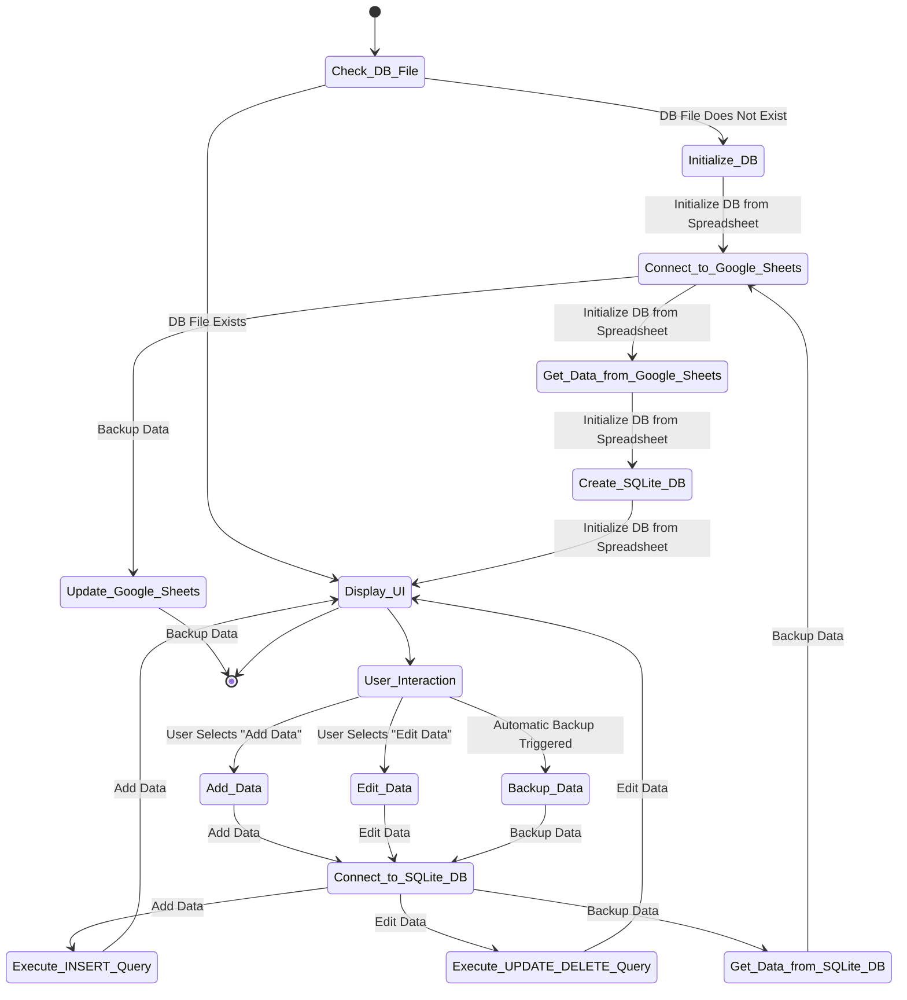

```mermaid
stateDiagram-v2
    [*] --> Check_DB_File
    Check_DB_File --> Initialize_DB: DB File Does Not Exist
    Check_DB_File --> Display_UI: DB File Exists
    Initialize_DB --> Connect_to_Google_Sheets: Initialize DB from Spreadsheet
    Connect_to_Google_Sheets --> Get_Data_from_Google_Sheets: Initialize DB from Spreadsheet
    Get_Data_from_Google_Sheets --> Create_SQLite_DB: Initialize DB from Spreadsheet
    Create_SQLite_DB --> Display_UI: Initialize DB from Spreadsheet
    Display_UI --> User_Interaction
    User_Interaction --> Add_Data: User Selects "Add Data"
    User_Interaction --> Edit_Data: User Selects "Edit Data"
    User_Interaction --> Backup_Data: Automatic Backup Triggered
    Add_Data --> Connect_to_SQLite_DB: Add Data
    Connect_to_SQLite_DB --> Execute_INSERT_Query: Add Data
    Execute_INSERT_Query --> Display_UI: Add Data
    Edit_Data --> Connect_to_SQLite_DB: Edit Data
    Connect_to_SQLite_DB --> Execute_UPDATE_DELETE_Query: Edit Data
    Execute_UPDATE_DELETE_Query --> Display_UI: Edit Data
    Backup_Data --> Connect_to_SQLite_DB: Backup Data
    Connect_to_SQLite_DB --> Get_Data_from_SQLite_DB: Backup Data
    Get_Data_from_SQLite_DB --> Connect_to_Google_Sheets: Backup Data
    Connect_to_Google_Sheets --> Update_Google_Sheets: Backup Data
    Update_Google_Sheets --> [*]: Backup Data
    Display_UI --> [*]
```
