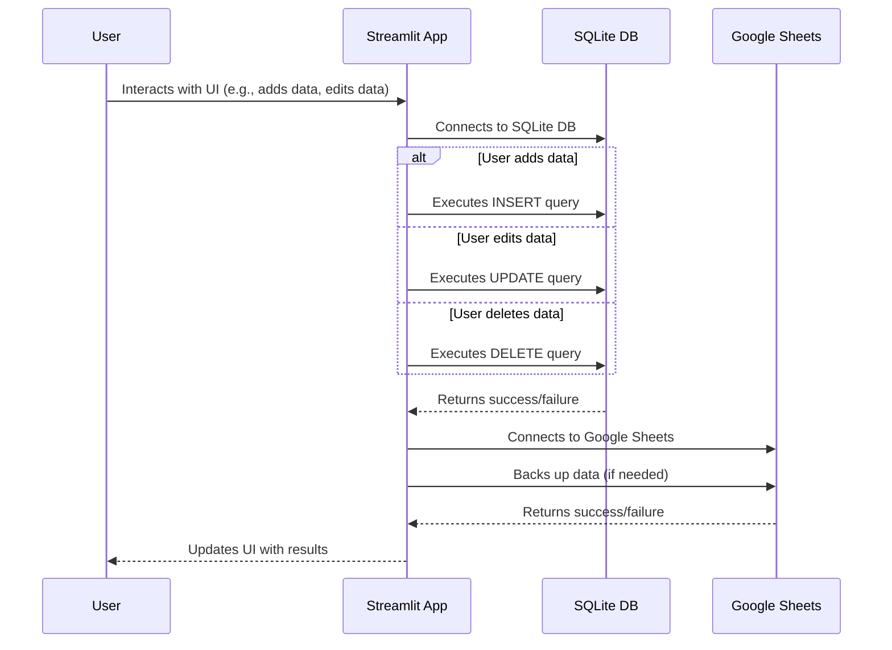

```mermaid
sequenceDiagram
    participant User
    participant Streamlit App
    participant SQLite DB
    participant Google Sheets

    User->>Streamlit App: Interacts with UI (e.g., adds data, edits data)
    Streamlit App->>SQLite DB: Connects to SQLite DB
    alt User adds data
        Streamlit App->>SQLite DB: Executes INSERT query
    else User edits data
        Streamlit App->>SQLite DB: Executes UPDATE query
    else User deletes data
        Streamlit App->>SQLite DB: Executes DELETE query
    end
    SQLite DB-->>Streamlit App: Returns success/failure
    Streamlit App->>Google Sheets: Connects to Google Sheets
    Streamlit App->>Google Sheets: Backs up data (if needed)
    Google Sheets-->>Streamlit App: Returns success/failure
    Streamlit App-->>User: Updates UI with results
```
