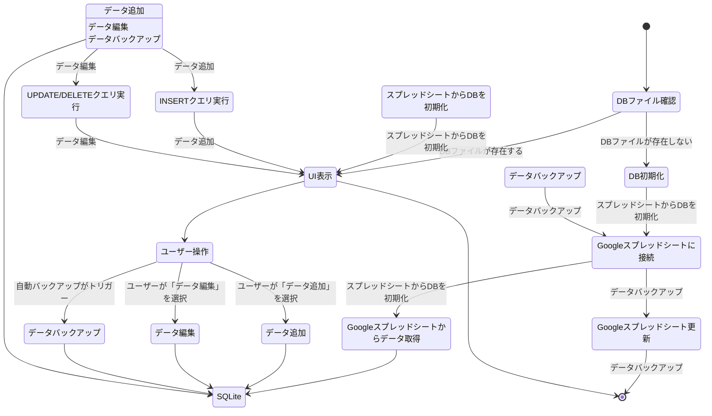

```mermaid
stateDiagram-v2
    [*] --> DBファイル確認
    DBファイル確認 --> DB初期化: DBファイルが存在しない
    DBファイル確認 --> UI表示: DBファイルが存在する
    DB初期化 --> Googleスプレッドシートに接続: スプレッドシートからDBを初期化
    Googleスプレッドシートに接続 --> Googleスプレッドシートからデータ取得: スプレッドシートからDBを初期化
    Googleスプレッドシートからデータ取得 --> SQLite DB作成: スプレッドシートからDBを初期化
    SQLite DB作成 --> UI表示: スプレッドシートからDBを初期化
    UI表示 --> ユーザー操作
    ユーザー操作 --> データ追加: ユーザーが「データ追加」を選択
    ユーザー操作 --> データ編集: ユーザーが「データ編集」を選択
    ユーザー操作 --> データバックアップ: 自動バックアップがトリガー
    データ追加 --> SQLite DBに接続: データ追加
    SQLite DBに接続 --> INSERTクエリ実行: データ追加
    INSERTクエリ実行 --> UI表示: データ追加
    データ編集 --> SQLite DBに接続: データ編集
    SQLite DBに接続 --> UPDATE/DELETEクエリ実行: データ編集
    UPDATE/DELETEクエリ実行 --> UI表示: データ編集
    データバックアップ --> SQLite DBに接続: データバックアップ
    SQLite DBに接続 --> SQLite DBからデータ取得: データバックアップ
    SQLite DBからデータ取得 --> Googleスプレッドシートに接続: データバックアップ
    Googleスプレッドシートに接続 --> Googleスプレッドシート更新: データバックアップ
    Googleスプレッドシート更新 --> [*]: データバックアップ
    UI表示 --> [*]
```
