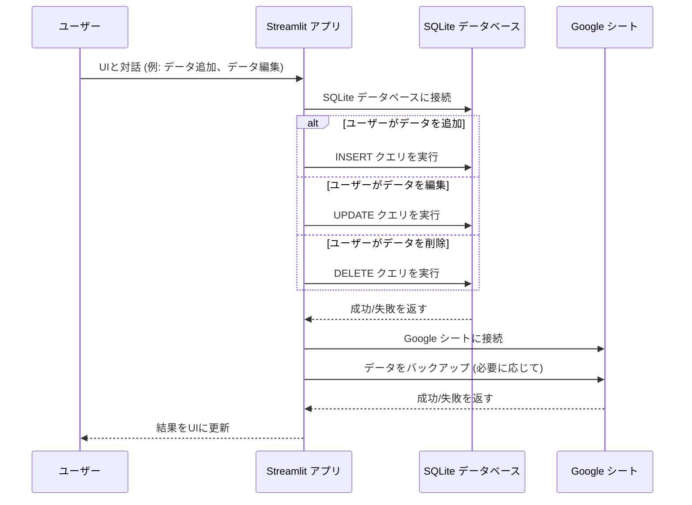

```mermaid
sequenceDiagram
    participant ユーザー
    participant Streamlit アプリ
    participant SQLite データベース
    participant Google シート

    ユーザー->>Streamlit アプリ: UIと対話 (例: データ追加、データ編集)
    Streamlit アプリ->>SQLite データベース: SQLite データベースに接続
    alt ユーザーがデータを追加
        Streamlit アプリ->>SQLite データベース: INSERT クエリを実行
    else ユーザーがデータを編集
        Streamlit アプリ->>SQLite データベース: UPDATE クエリを実行
    else ユーザーがデータを削除
        Streamlit アプリ->>SQLite データベース: DELETE クエリを実行
    end
    SQLite データベース-->>Streamlit アプリ: 成功/失敗を返す
    Streamlit アプリ->>Google シート: Google シートに接続
    Streamlit アプリ->>Google シート: データをバックアップ (必要に応じて)
    Google シート-->>Streamlit アプリ: 成功/失敗を返す
    Streamlit アプリ-->>ユーザー: 結果をUIに更新
```
